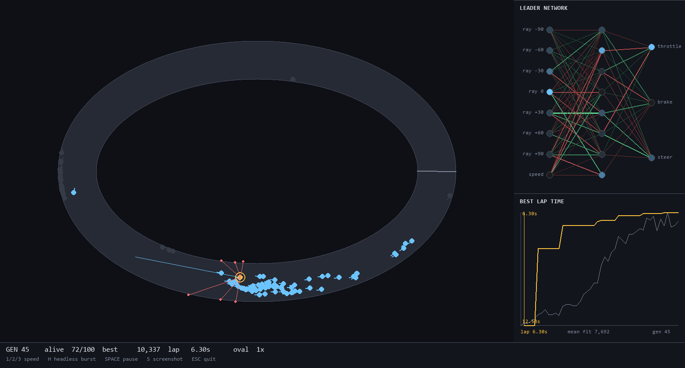

# NeuroRacer

Cars that teach themselves to race, with the champion's neural network drawn
live beside the track as the generations improve.

No PyTorch, no gradients. A population of 100 tiny neural networks — 99 weights
each — is scored on a lap, the worst are discarded, the best are bred and
mutated, repeat. Everything runs in one pygame window at 60fps, or headless at
about 2.5 generations per second.



## Quick start

```bash
python -m venv venv
venv\Scripts\python.exe -m pip install -r requirements.txt

venv\Scripts\python.exe main.py --track snake      # watch it learn
venv\Scripts\python.exe drive.py snake             # drive it yourself
venv\Scripts\python.exe train.py --track snake --generations 200   # headless
```

| Key | |
| --- | --- |
| `1` `2` `3` | playback speed 1× / 4× / 16× |
| `H` | headless burst — 10 generations with no rendering |
| `SPACE` | pause |
| `S` | screenshot |
| `ESC` | quit |

## Results

Trained 200 generations, population 100, seed 1. Lap times are the best
achieved by any car.

| Track | Lap length | Tightest corner | Best lap | First lap at | Finishing by gen 200 |
| --- | --- | --- | --- | --- | --- |
| oval | 2166px | 161px | **5.98s** | generation 1 | — |
| chicane | 2512px | 172px | **7.87s** | generation 8 | 97 / 100 |
| snake | 2436px | 70px | **8.47s** | generation 12 | 97 / 100 |

### The interesting result

Three champions trained identically — same algorithm, same 99 weights, same
seed — differing only in which track they saw. Each was then dropped at 72
different starting poses (24 points around the lap × 3 lateral offsets) on all
three tracks, and scored on how many of those starts it could complete a lap
from:

| Champion | oval | snake | chicane |
| --- | --- | --- | --- |
| trained on **oval** | 6% | 0% | 0% |
| trained on **chicane** | **100%** | 0% | **100%** |
| trained on **snake** | **100%** | **100%** | **100%** |

The oval champion has the fastest lap time and cannot drive. It never learned a
policy — it memorised one open-loop trajectory, and it fails even on its own
training track if you move it thirty pixels sideways. An oval turns one way
with near-constant curvature, so a fixed steering bias solves it and there is
no selection pressure to read the sensors at all.

The chicane champion is the one that explains the mechanism. It *is* a real
sensor-reading policy — 100% robust from any start on two tracks. But it dies
on snake, and it dies at exactly one place: the 70px hairpin. Chicane's
tightest corner is 172px, and the car must slow to ~145 px/s for 70px versus
~280 px/s for 172px. It learned a genuine policy for the range of corners it
was shown, and no further.

**The generalisation ceiling is set by the hardest corner in the training
distribution** — not by the algorithm and not by the network size.

Full write-up: [docs/devlog/05-it-memorised-the-track.md](docs/devlog/05-it-memorised-the-track.md)

The final champions are committed under `champions/`, so the numbers above can
be re-measured rather than taken on trust:

```bash
venv\Scripts\python.exe evaluate.py --run champions/snake --track oval --shot
venv\Scripts\python.exe robustness.py --run champions/snake --all-tracks
```

## How it works

**A track is three arrays.** Authored as a centerline polyline plus a width,
then rasterised once into `drivable`, `progress` and `checkpoint` maps over the
1200×800 world. Collision becomes an array lookup. Lap progress is read
straight off the map — no checkpoint bookkeeping. Raycasting is 48 samples
along each ray gathered from the mask, so there is no ray/segment intersection
code anywhere in the project.

**The whole population moves in lockstep.** No `for car in cars`. Positions,
velocities and genomes are stacked arrays, and the entire population's forward
pass is two `einsum` calls, so 100 cars costs about what 1 car costs.

**Sensors → network → controls.** Seven raycast distances spread ±90°, plus
normalised speed, into 8 → 8 → 3 (throttle, brake, steer). 99 weights, kept
deliberately small so that every connection can be drawn individually in the
visualiser and stay legible.

**Fitness is staged.** Progress along the lap while nobody can finish; best lap
time once they can. A crash ends the run but the car keeps what it earned —
punishing crashes harder than idling makes generation 1 evolve into parked
cars. Three seconds without forward progress and the car is culled.

**Steering fades with speed**, which is the only reason braking for corners is
something the network has to discover. `tests/test_premise.py` measures this
from the simulation and fails if a change ever makes flooring it optimal
everywhere.

## Layout

```
config.py            every tunable, one frozen dataclass
main.py              the live app
train.py             headless training
drive.py             arrow-key driving, human baseline
evaluate.py          replay a champion, draw its trajectory by speed
robustness.py        policy or memorised trajectory?
src/
  track.py           centerline + width -> the three masks
  tracks.py          oval, snake, chicane
  physics.py         arcade step over population arrays
  sensors.py         vectorised mask-sampling raycast
  net.py             batched 8-8-3 MLP, flat genome
  fitness.py         staged scoring, wrapped progress, idle culling
  evolve.py          elitism, tournament selection, annealed mutation
  simulation.py      headless generation runner (never imports pygame)
  render/            track, network, chart and HUD panels
tools/               benchmarks and track-shape probes
docs/devlog/         build log
```

`src/simulation.py` and everything below it never import pygame — a test
enforces it in a fresh interpreter. That is what keeps training headless.

## Tests

```bash
venv\Scripts\python.exe -m pytest
```

89 tests. The ones worth knowing about:

- `test_premise.py` — the tracks must contain corners the car cannot take flat
  out, and must be driveable at some speed. Fails loudly if tuning ever makes
  the problem boring.
- `test_track_does_not_self_intersect` — a progress map stores one value per
  pixel, so a self-crossing track is unrepresentable. This is why there is no
  figure-eight.
- `test_car_cannot_ride_the_wall` — collision uses the car's body, not a
  dimensionless point. The first random population found the wall-hugging
  exploit immediately.
- `test_a_parked_car_scores_below_a_car_that_progressed_then_crashed` — the
  single most important property in the fitness function.
- `test_recording_does_not_change_the_outcome` — the renderer is a passive
  observer; what you watch is what the trainer scored.

## Build log

1. [A track is three arrays](docs/devlog/01-a-track-is-three-arrays.md)
2. [Is there actually anything to learn?](docs/devlog/02-is-there-anything-to-learn.md)
3. [Generation one cheats](docs/devlog/03-generation-one-cheats.md)
4. [Watching it learn](docs/devlog/04-watching-it-learn.md)
5. [One of them learned to drive. The other memorised a track.](docs/devlog/05-it-memorised-the-track.md)
