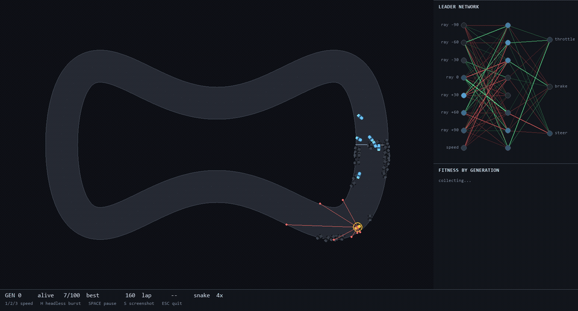
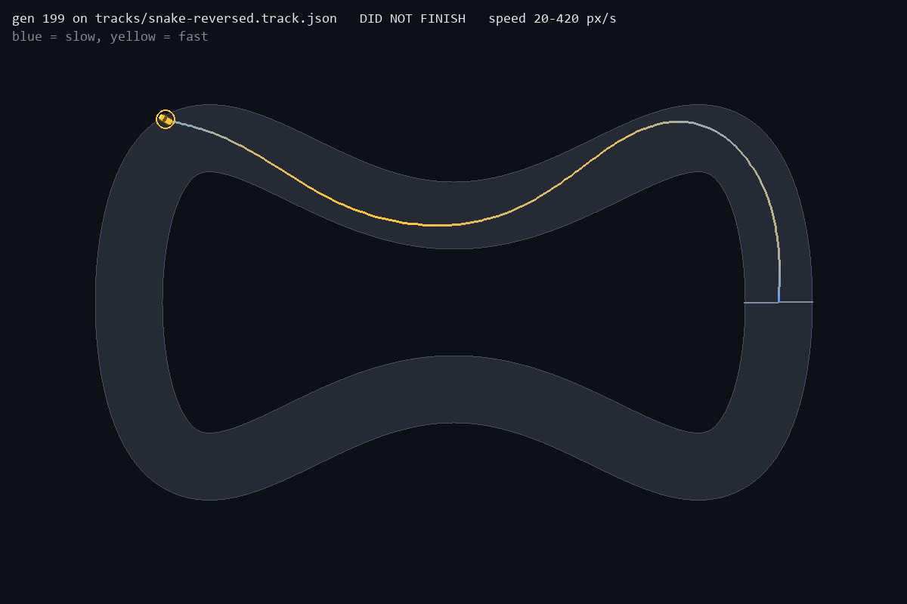
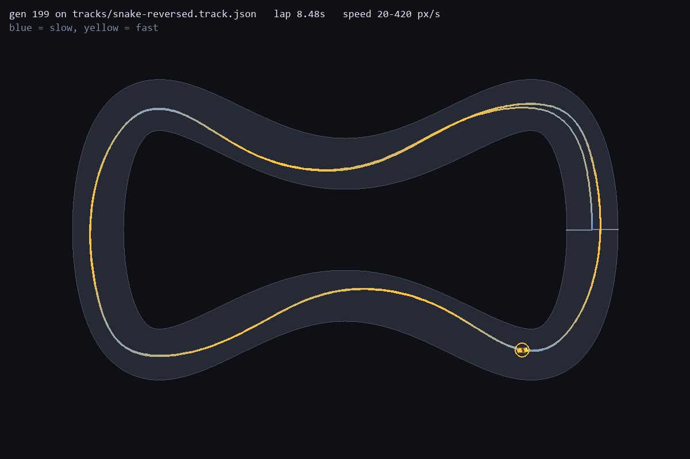
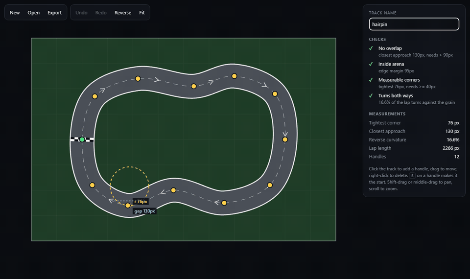

# NeuroRacer

[](https://github.com/ethanstoner/neuro-racer/actions/workflows/tests.yml)

Cars that teach themselves to race by neuroevolution, used as a small lab for
one question: when a trained policy looks like it generalises, does it? Every
claim here was tested with a prediction committed to git before the run, and
several of those predictions were wrong.

**Live demo: https://neuroracer.ethanstoner.dev**, the companion track
editor, which runs in the browser. Training and the experiments run locally in
Python.



*80 generations on `snake`, unedited. Generation 0 puts 7 of 100 cars through a
wall in the first corner; by generation 79, 83 of them are lapping and the best
has gone from 23.70s to 9.37s. The panel on the right is the leading car's
actual network, redrawn every generation as it evolves.*

### Highlights

- **Found a hidden bias in the headline result.** The champion presented as the
  one that generalises laps **43 of 43** clockwise held-out tracks and **0 of
  42** counter-clockwise ones, and 0% of starts on all seven built-in tracks
  driven the other way, its own included. Every built-in track ran clockwise,
  so nothing had tested it.
- **Fixed it, and proved what fixed it.** Training both directions made **5 of
  5** seeds lap all 100 generated held-out tracks and all 7 built-ins both ways.
  Budget-matched controls got a two-way driver in only 1 of 5 seeds (twice the
  generations) and 0 of 5 (a second clockwise track).
- **Showed the "corner floor" was a training artefact.** On a 32-rung sweep the
  floor goes from 43px after 200 one-way generations, to 27px after 400, to
  12px (the end of the ruler) when trained both ways.
- **Built a companion track editor, tested for parity with the trainer.** A
  TypeScript editor ([virtual-world](https://github.com/ethanstoner/virtual-world))
  measures tracks live using ports of the trainer's numpy code, agreeing to
  within 0.005 on a fresh export. 30 tests cover it, 14 of them driving the
  real app in a browser with mouse and touch.

**Python · NumPy · pygame** for the simulator and trainer, **TypeScript ·
Canvas · Vite · Playwright** for the editor.

## What it found

Each step below came from testing the previous claim harder. The devlog has the
full write-ups, including the predictions that failed.

**1. One champion learned to drive; another memorised a track.** Three
champions, trained identically on different tracks, each dropped at 72 start
poses:

| Champion | oval | snake | chicane |
| --- | --- | --- | --- |
| trained on **oval** | 6% | 0% | 0% |
| trained on **chicane** | **100%** | 0% | **100%** |
| trained on **snake** | **100%** | **100%** | **100%** |

The oval champion had the fastest lap and couldn't drive. It had memorised one
open-loop trajectory and failed its own track from 30px off the line
([devlog 05](docs/devlog/05-it-memorised-the-track.md)).

**2. A held-out test broke the first explanation.** "A champion laps a track iff
its corners are no tighter than its training" scored 8 of 12 on four unseen
tracks, and every miss was a champion doing *better*
([06](docs/devlog/06-prediction.md), [07](docs/devlog/07-the-held-out-test.md)).
A corner sweep put the floor at about 0.75 of the hardest training corner.

**3. 100 generated tracks exposed direction.** A seeded generator
(`src/procgen.py`) made held-out tracks nobody picked. The snake champion lapped
**43 of 43** clockwise tracks above its floor and **0 of 42** counter-clockwise.
Reversed, it laps none of the seven built-ins, its own included
([08](docs/devlog/08-prediction-generated.md), [09](docs/devlog/09-the-generated-test.md)).

| snake champion, its own track reversed: crashes 3.9s in | both-ways champion, same track: 8.48s |
| --- | --- |
|  |  |

**4. Direction has to be trained.** Five seeds per condition, with controls
matched to the both-ways budget
([10](docs/devlog/10-prediction-direction.md) to [13](docs/devlog/13-more-training.md)):

| Training | drives both ways | generated tracks lapped (median of 5) |
| --- | --- | --- |
| forward, 200 generations | 2 of 4 that learned | 48 / 100 |
| forward, 400 generations (same budget) | 1 of 5 | 62 / 100 |
| snake + chicane, both clockwise (same budget) | 0 of 5 | 60 / 100 |
| **both directions** | **5 of 5** | **100 / 100** |

The published champion was seed 1 of the forward runs: the extreme case, not
the typical one.

**5. The corner floor depends on training, not the network.** A finer sweep, 32
rungs down to 12px ([14](docs/devlog/14-prediction-floors.md),
[15](docs/devlog/15-floors-and-random-starts.md)):

| Training | corner floor (median, runs that learned) |
| --- | --- |
| forward, 200 generations | 43px |
| forward, 400 generations | 27px |
| **both directions** | **12px**, the end of the ruler |

Below about 45px, centerline radius stops describing the corner the car drives.
Champions lap "12px corners" on a far wider line. Training from a random start
pose every generation fixed a robustness drift on the training track, but
didn't improve generalisation: it made robust specialists.

## Architecture

```
centerline + width ──rasterise once──▶ drivable / progress / checkpoint masks (1200×800)
                                                     │ array lookups
population (100 × 99-weight genomes)                 ▼
   7 raycasts + speed ──▶ 8-8-3 MLP ──▶ throttle, brake, steer ──▶ physics step ×2400
                                                     │
                     staged fitness: progress, then lap time
                                                     ▼
                  elitism + tournament selection + annealed mutation ──▶ next generation
```

**A track is three arrays.** Collision, lap progress and raycasting are lookups
into masks rasterised once from the centerline, so there is no geometry code in
the hot loop. Raycasting is 48 samples along each ray.

**The whole population moves in lockstep.** Positions, velocities and genomes
are stacked arrays, and the population's forward pass is two `einsum` calls:

| Population | ms / tick | µs per car-tick | vs. 1 car |
| --- | --- | --- | --- |
| 1 | 0.11 | 111 | 1.0× |
| 10 | 0.15 | 15 | 1.3× |
| 100 | 0.63 to 0.79 | 6.3 to 7.9 | 5.7× to 7.0× |
| 500 | 3.6 to 3.7 | 7.1 to 7.4 | 32× |

(`tools/tick_cost.py`, best of five, two runs.)

**Fitness is staged.** Progress along the lap until someone finishes, then lap
time. A crash ends the run but keeps what the car earned; punishing crashes
harder than idling makes generation 1 evolve parked cars.

**Steering fades with speed**, which is the only reason braking is something to
learn. `tests/test_premise.py` measures this from the simulation and fails if
tuning ever makes flooring it optimal everywhere.

## The track editor



Tracks are drawn in [virtual-world](https://github.com/ethanstoner/virtual-world),
a browser editor built for this project. It runs entirely in the browser, with
nothing to install: [neuroracer.ethanstoner.dev](https://neuroracer.ethanstoner.dev).
It re-measures the track on every drag (2.5 to 3.8ms per analysis) using TypeScript ports of the trainer's
measurements, blocks export while a track breaks a rule the trainer enforces,
and writes the JSON `scripts.train --track` loads directly. Parity is tested in
both directions: a file exported from the editor's UI is a fixture here, and a
file written here is a fixture there.

## Engineering highlights

- Designed the evaluation around **pre-registration**: five prediction documents
  committed before their runs (commits cited in each devlog). Six of the 16
  scored predictions in devlogs 10, 12 and 14 were wrong, and each is written up
  as a miss rather than re-explained.
- **Made training deterministic and proved it**: re-running seed 1 rebuilds the
  published champion bit for bit, so every result can be re-derived from a seed.
- **Vectorised the whole population**: a tick for 100 cars costs 5.7 to 7.0×
  what one car costs, not 100×, because per-call NumPy overhead is shared. The 30 training runs
  behind devlogs 11 to 15 ran in three parallel batches of 15 to 17 minutes
  each.
- **Built budget-matched controls** (400 generations; a second clockwise track)
  to separate the effect of direction data from the effect of more simulation.
- **Kept the measurements honest across languages**: the virtual-world editor
  ports the track metrics to TypeScript. Parity is tested both ways through
  fixture files, which also exposed that rounding coordinates to 0.01px moves
  the corner-radius reading by about 3%.

## Getting started

Python 3.11 or 3.12. From the repo root:

```bash
python3 -m venv venv              # Windows: python -m venv venv
source venv/bin/activate          # Windows: venv\Scripts\activate
pip install -r requirements.txt

python -m scripts.app --track snake        # watch it learn (opens a window)
python -m scripts.drive snake              # drive it yourself
python -m scripts.train --track snake --generations 200
```

`scripts.train` is headless; `--generations 3` is a one-second smoke test.
Run everything from the repo root. `scripts.train` also takes
`--direction both`, several track names (`--track snake chicane`),
`--random-starts`, and track files from the virtual-world editor
(`--track my-track.track.json`).

In the live app: `1` `2` `3` set playback speed, `H` runs 10 generations
headless, `SPACE` pauses, `S` saves a screenshot.

### Reproducing the results

The champions are committed under `data/champions/`, so none of this has to be
taken on trust:

```bash
python -m experiments.heldout      # the four hand-made held-out tracks
python -m experiments.generalise   # champions vs 100 generated tracks
python -m experiments.direction    # every training condition, both directions
python -m experiments.floors       # the 32-rung corner sweep
```

`experiments.direction` and `experiments.floors` read training runs from
`runs/`, which isn't committed. The command for each run is at the top of its
devlog. Results land in `docs/results/`.

## Testing

```bash
python -m pytest        # 212 tests, all headless, run in CI
```

On a machine with no display, set `SDL_VIDEODRIVER=dummy` first, as CI does.

The ones worth knowing about:

- `test_premise.py`: the tracks must contain corners the car can't take flat
  out, so a tuning change can't quietly make the problem trivial.
- `test_car_cannot_ride_the_wall`: collision uses the car's body. The first
  random population found the wall-hugging exploit immediately.
- `test_heldout.py`: pins the published claims to the committed champions,
  including `test_the_snake_champion_only_drives_one_way_round` and
  `test_training_both_ways_round_fixes_it`.
- `test_editor_measurements_match_numpy`: the editor's TypeScript measurements
  against the numpy originals, on a file exported from the editor's UI.

## Project structure

```
src/           simulation library: tracks, physics, sensors, network, evolution, config
scripts/       things you run: train, app (live view), drive, evaluate, preview_track
experiments/   the studies behind the devlog: heldout, generalise, direction, floors, robustness
tools/         instrumentation: benchmarks, corner sweep, track probes
data/          committed champions and track files
docs/          devlog, and results/ with the JSON behind every table
tests/         pytest suite
```

## What I learned

- **The test set decides the result.** Every tidy conclusion here came from
  tracks I'd drawn, and every one changed on a set nobody picked. The
  clockwise-only built-ins hid the biggest effect in the project for a month.
- **Writing the prediction down first is what makes a miss useful.** Four
  predictions failed in the last round alone. Because they were in git before
  the runs, each failure pointed at what to test next instead of getting
  quietly re-explained.
- **One seed is an anecdote.** The published champion was one of two forward
  seeds, out of the four that learned, that couldn't drive the other way at all. Five seeds per
  condition cost about 16 minutes in parallel.

## Build log

1. [A track is three arrays](docs/devlog/01-a-track-is-three-arrays.md)
2. [Is there actually anything to learn?](docs/devlog/02-is-there-anything-to-learn.md)
3. [Generation one cheats](docs/devlog/03-generation-one-cheats.md)
4. [Watching it learn](docs/devlog/04-watching-it-learn.md)
5. [One of them learned to drive. The other memorised a track.](docs/devlog/05-it-memorised-the-track.md)
6. [A prediction, written down first](docs/devlog/06-prediction.md)
7. [The held-out test, and the prediction it broke](docs/devlog/07-the-held-out-test.md)
8. [A prediction for 100 tracks nobody drew](docs/devlog/08-prediction-generated.md)
9. [100 tracks nobody drew, and the direction nobody tested](docs/devlog/09-the-generated-test.md)
10. [Prediction: is the one-way bias in the data or the network?](docs/devlog/10-prediction-direction.md)
11. [Both ways round](docs/devlog/11-both-ways-round.md)
12. [Prediction: direction, or just more training?](docs/devlog/12-prediction-budget.md)
13. [Direction, and more training](docs/devlog/13-more-training.md)
14. [Prediction: the real corner floor, and random start poses](docs/devlog/14-prediction-floors.md)
15. [The corner floor, and random start poses](docs/devlog/15-floors-and-random-starts.md)

## License

MIT, see [LICENSE](LICENSE).
