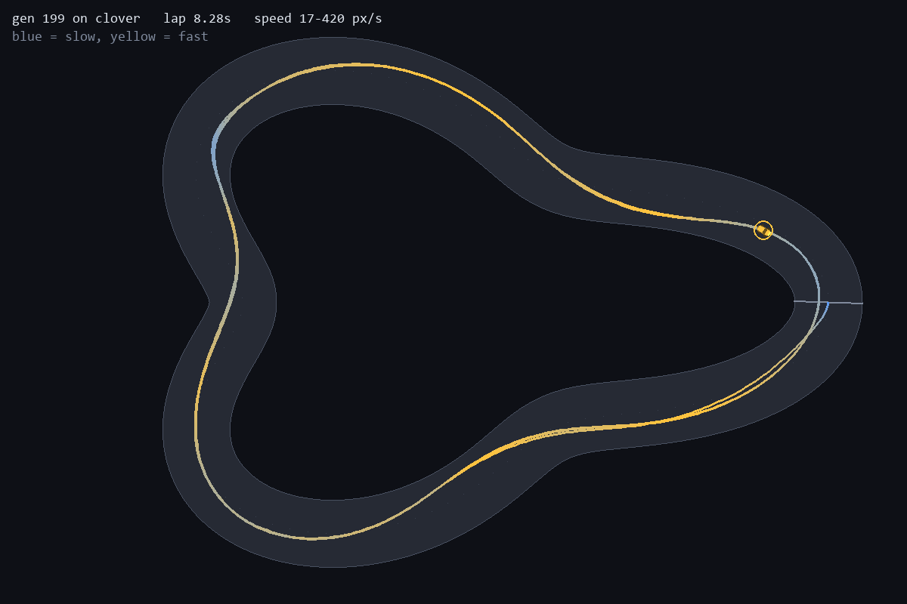
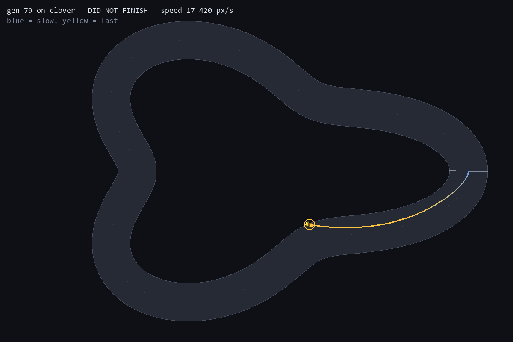

# NeuroRacer

[](https://github.com/ethanstoner/neuro-racer/actions/workflows/tests.yml)
[](https://www.python.org/)
[](LICENSE)

Cars that teach themselves to race, with the champion's neural network drawn
live beside the track as the generations improve.

No PyTorch, no gradients. A population of 100 tiny neural networks — 99 weights
each — is scored on a lap, the worst are discarded, the best are bred and
mutated, repeat. Everything runs in one pygame window at 60fps, or headless at
about 3 generations per second.


*80 generations on `snake`, unedited. Generation 0 puts 7 of 100 cars through a
wall in the first corner; by generation 79, 83 of them are lapping and the best
has gone from 23.70s to 9.37s. The panel on the right is the leading car's
actual network — green weights excitatory, red inhibitory — redrawn every
generation as it evolves.*

## Quick start

```bash
python -m venv venv
venv\Scripts\python.exe -m pip install -r requirements.txt

venv\Scripts\python.exe main.py --track snake      # watch it learn
venv\Scripts\python.exe drive.py snake             # drive it yourself
venv\Scripts\python.exe train.py --track snake --generations 200   # headless
venv\Scripts\python.exe train.py --track my-track.track.json         # a track file
```

Track files come from the companion virtual-world editor. It checks a track live
against the same rules the loader enforces (no overlap, inside the arena, no
corner under 40px) and exports JSON that `--track` accepts anywhere a track
name is accepted.

| Key | |
| --- | --- |
| `1` `2` `3` | playback speed 1× / 4× / 16× |
| `H` | headless burst — 10 generations with no rendering |
| `SPACE` | pause |
| `S` | screenshot |
| `ESC` | quit |

## Results

Trained 200 generations, population 100, seed 1. Lap times are the best
achieved by any car.

| Track | Lap length | Tightest corner | Best lap | First lap at | Finishing by gen 200 |
| --- | --- | --- | --- | --- | --- |
| oval | 2166px | 161px | **5.98s** | generation 1 | — |
| chicane | 2512px | 172px | **7.87s** | generation 8 | 97 / 100 |
| snake | 2436px | 70px | **8.47s** | generation 12 | 97 / 100 |

Four further tracks — clover (52px), peanut (108px), ripple (51px) and keyhole
(100px) — are **held out**. Nothing trains on them; they exist only to test
champions on corners they have never seen.

### The interesting result

Three champions trained identically — same algorithm, same 99 weights, same
seed — differing only in which track they saw. Each was then dropped at 72
different starting poses (24 points around the lap × 3 lateral offsets) and
scored on how many of those starts it could complete a lap from:

| Champion | oval | snake | chicane |
| --- | --- | --- | --- |
| trained on **oval** | 6% | 0% | 0% |
| trained on **chicane** | **100%** | 0% | **100%** |
| trained on **snake** | **100%** | **100%** | **100%** |

The oval champion has the fastest lap time and cannot drive. It never learned a
policy — it memorised one open-loop trajectory, and it fails even on its own
training track if you move it thirty pixels sideways. An oval turns one way
with near-constant curvature, so a fixed steering bias solves it and there is
no selection pressure to read the sensors at all.

Full write-up: [docs/devlog/05-it-memorised-the-track.md](docs/devlog/05-it-memorised-the-track.md)

### Then I tested it properly, and it was wrong

Those three tracks were chosen by me, partly because they made the point. So
four more were built as a held-out set, trained on by nothing, and a prediction
was written down before running anything
([docs/devlog/06-prediction.md](docs/devlog/06-prediction.md)):

> a champion laps a track iff that track's tightest corner is at or above the
> tightest corner it saw in training.

It scored **8 of 12** champion-track pairs, and all four misses ran the same
way — champions cleared corners *tighter* than anything they had trained on.
Snake, trained on a 70px hairpin, laps ripple's 51px corner from 97% of starts.

The held-out tracks were too coarse to locate the real limit, so
`tools/corner_sweep.py` walks each champion down a family of tracks that differ
only in corner tightness:

| Champion | Hardest corner trained on | Measured floor | ratio |
| --- | --- | --- | --- |
| oval | 161px | never cleared even the widest rung | — |
| chicane | 172px | **131px** | 0.76 |
| snake | 70px | **51px** | 0.73 |

Two champions trained on different tracks land on the same ratio, and the
failure is a cliff rather than a slope: chicane holds 48/48 starts at 131px and
drops to 2/48 at 106px. The corrected claim:

**A champion that learns a real policy generalises to corners roughly 25%
tighter than the hardest one it trained on, then fails abruptly. A champion
that memorises a trajectory has no floor at all** — the oval champion fails
rungs *gentler* than the track it trained on.

Both champions on clover, a track neither had seen. Trajectory coloured by
speed — yellow fast, blue slow:

| snake-trained — laps it in 8.28s | oval-trained — did not finish |
| --- | --- |
|  |  |

The left trace brakes to blue for both tight corners. The right one never leaves
yellow — it never brakes at all, because it is not reading anything.

Corner radius is not a complete measure of difficulty, and the write-up is
explicit about where that shows
([docs/devlog/07-the-held-out-test.md](docs/devlog/07-the-held-out-test.md)).

### Then 100 tracks nobody drew, and a direction nobody tested

Seven hand-drawn tracks are still seven tracks picked by one person. So
`src/procgen.py` generates held-out tracks from a seed, and devlog 08 wrote down
what the corner floors predict for 100 of them before any champion ran:

| Champion | floor | own track | 100 generated tracks | predicted | correct |
| --- | --- | --- | --- | --- | --- |
| oval | none | 6% | 0 lapped | 0 | 100% |
| chicane | 131px | 100% | 19 lapped | 8 | 87% |
| snake | 51px | 100% | 48 lapped | 85 | **53%** |

Snake failed 42 tracks that were wider than its floor, and corners had nothing
to do with it. The generator flips a coin for driving direction, and every
built-in track runs clockwise. **On generated tracks above its floor, snake laps
43 of 43 clockwise and 0 of 42 counter-clockwise.** Reversing the built-in
tracks confirms it:

| Champion | own track | own track, reversed | all 7 built-ins, reversed |
| --- | --- | --- | --- |
| snake | 100% | **0%** | 0% on every one |
| chicane | 100% | 93% | laps oval 100%, peanut 94% |

The champion that looked like the real generaliser only drives one way round.
In the direction it trained in, the corner floor still holds (90% correct for
snake), and it is conservative: the misses are laps on corners *tighter* than
the floor. Full write-up:
[docs/devlog/09-the-generated-test.md](docs/devlog/09-the-generated-test.md).


The champions are committed under `champions/`, so none of this has to be taken
on trust:

```bash
venv\Scripts\python.exe generalise.py              # train vs 100 generated tracks
venv\Scripts\python.exe heldout.py                 # the held-out table
venv\Scripts\python.exe tools/corner_sweep.py      # the floors
venv\Scripts\python.exe robustness.py --run champions/snake --all-tracks
```

## How it works

**A track is three arrays.** Authored as a centerline polyline plus a width,
then rasterised once into `drivable`, `progress` and `checkpoint` maps over the
1200×800 world. Collision becomes an array lookup. Lap progress is read
straight off the map — no checkpoint bookkeeping. Raycasting is 48 samples
along each ray gathered from the mask, so there is no ray/segment intersection
code anywhere in the project.

**The whole population moves in lockstep.** No `for car in cars`. Positions,
velocities and genomes are stacked arrays, and the entire population's forward
pass is two `einsum` calls. Measured cost of one simulation tick:

| Population | ms / tick | µs per car-tick | vs. 1 car |
| --- | --- | --- | --- |
| 1 | 0.079 | 79.4 | 1.0× |
| 10 | 0.120 | 12.0 | 1.5× |
| 100 | 0.692 | 6.9 | 8.7× |
| 500 | 2.940 | 5.9 | 37.0× |

100 cars cost 8.7× one car rather than 100×, because per-car cost falls 11× as
the population absorbs NumPy's fixed per-call overhead. It is not free — it is
sub-linear, and that is the whole reason 200-generation runs finish in a couple
of minutes. A full generation is ~0.35s at population 100, or **3.1
generations/second** headless (`tools/bench.py`).

**Sensors → network → controls.** Seven raycast distances spread ±90°, plus
normalised speed, into 8 → 8 → 3 (throttle, brake, steer). 99 weights, kept
deliberately small so that every connection can be drawn individually in the
visualiser and stay legible.

**Fitness is staged.** Progress along the lap while nobody can finish; best lap
time once they can. A crash ends the run but the car keeps what it earned —
punishing crashes harder than idling makes generation 1 evolve into parked
cars. Three seconds without forward progress and the car is culled.

**Steering fades with speed**, which is the only reason braking for corners is
something the network has to discover. `tests/test_premise.py` measures this
from the simulation and fails if a change ever makes flooring it optimal
everywhere.

## Layout

Anything you run lives at the top level. `src/` is library code with no CLI,
`tools/` is instrumentation that measures the project rather than using it.

```
config.py            every tunable, one frozen dataclass

main.py              the live app
train.py             headless training
drive.py             arrow-key driving, human baseline
evaluate.py          replay a champion, draw its trajectory by speed
preview_track.py     rasterise a track to PNG
robustness.py        policy, or one memorised trajectory?
heldout.py           every champion vs. the four unseen tracks
generalise.py        every champion vs. a seeded set of generated tracks

src/                 library -- imported, never executed
  track.py           centerline + width -> the three masks, corner geometry
  tracks.py          3 training tracks + 4 held out; load() also takes a file path
  track_io.py        track files: the editor's format, and the rules it must pass
  procgen.py         seeded star-shaped tracks for held-out sets
  physics.py         arcade step over population arrays
  sensors.py         vectorised mask-sampling raycast
  net.py             batched 8-8-3 MLP, flat genome
  fitness.py         staged scoring, wrapped progress, idle culling
  evolve.py          elitism, tournament selection, annealed mutation
  robustness.py      spawn grid + lap-rate assessment
  simulation.py      headless generation runner (never imports pygame)
  artifacts.py       run recorder -- history.csv and champions.json
  pump.py            background generation worker for the live app
  render/            track, network, chart and HUD panels

tools/               instrumentation, not part of the project's own workings
  bench.py             per-tick and per-generation cost
  corner_sweep.py      each champion's generalisation floor
  premise_report.py    cornering numbers behind the physics tuning
  probe_tracks.py      score candidate track shapes before adopting them
  profile_live_loop.py where a frame's time actually goes
  reproduce_wall_hug.py the generation-1 exploit, on demand
  export_champions.py  promote a run into champions/

tracks/              track files (snake reversed, for devlog 09)
champions/           the three trained champions, committed so the published
                     numbers can be re-measured rather than trusted
tests/               all headless, so they run in CI
docs/devlog/         build log, written as the thing was built
```

`src/simulation.py` and everything below it never import pygame — a test
enforces it in a fresh interpreter. That is what keeps training headless.

## Tests

```bash
venv\Scripts\python.exe -m pytest
```

All headless, so they run in CI. The ones worth knowing about:

- `test_premise.py` — the tracks must contain corners the car cannot take flat
  out, and must be driveable at some speed. Fails loudly if tuning ever makes
  the problem boring.
- `test_track_does_not_self_intersect` — a progress map stores one value per
  pixel, so a self-crossing track is unrepresentable. This is why there is no
  figure-eight.
- `test_car_cannot_ride_the_wall` — collision uses the car's body, not a
  dimensionless point. The first random population found the wall-hugging
  exploit immediately.
- `test_a_parked_car_scores_below_a_car_that_progressed_then_crashed` — the
  single most important property in the fitness function.
- `test_recording_does_not_change_the_outcome` — the renderer is a passive
  observer; what you watch is what the trainer scored.
- `test_heldout.py` — pins the three published generalisation claims to the
  committed champions, so a physics or fitness change cannot silently leave the
  README asserting something untrue.
- `test_the_snake_champion_only_drives_one_way_round` — pins devlog 09, with
  the chicane champion surviving reversal as the control.
- `test_editor_measurements_match_numpy` — the editor's live checks are a
  TypeScript port; this compares them against the numpy originals on a file
  exported from the editor's UI, to 0.01px.
- `test_spawn_poses_face_along_the_track` — if the robustness harness spawned
  cars facing across the track, every champion would score 0% and the finding
  would read as "nothing generalises" when the truth is "the harness is broken".

## Build log

1. [A track is three arrays](docs/devlog/01-a-track-is-three-arrays.md)
2. [Is there actually anything to learn?](docs/devlog/02-is-there-anything-to-learn.md)
3. [Generation one cheats](docs/devlog/03-generation-one-cheats.md)
4. [Watching it learn](docs/devlog/04-watching-it-learn.md)
5. [One of them learned to drive. The other memorised a track.](docs/devlog/05-it-memorised-the-track.md)
6. [A prediction, written down first](docs/devlog/06-prediction.md)
7. [The held-out test, and the prediction it broke](docs/devlog/07-the-held-out-test.md)
8. [A prediction for 100 tracks nobody drew](docs/devlog/08-prediction-generated.md)
9. [100 tracks nobody drew, and the direction nobody tested](docs/devlog/09-the-generated-test.md)
10. [Prediction: is the one-way bias in the data or the network?](docs/devlog/10-prediction-direction.md)

## License

MIT — see [LICENSE](LICENSE).
