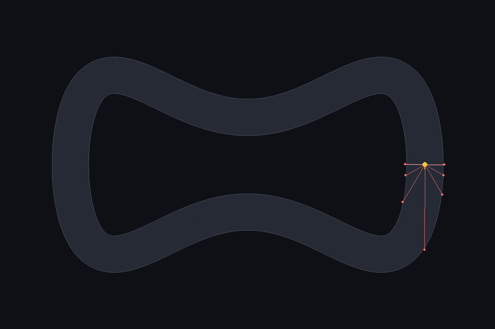

# 1. A track is three arrays

*2026-08-26*

The obvious way to build a racing game is to store the track as geometry: a
list of wall segments, and then ray-versus-segment maths for the sensors,
circle-versus-segment for collisions, and some kind of checkpoint bookkeeping
for lap progress. That is three separate pieces of geometry code, each with its
own edge cases, all of which have to agree with each other.

I did not do that. A track here is authored as a **centerline polyline plus a
width**, and rasterised once at startup into three NumPy arrays over the 1200×800
world:

| Array | Type | What it gives you |
| --- | --- | --- |
| `drivable[y, x]` | bool | Is this pixel tarmac |
| `progress[y, x]` | float | How far around the lap this pixel is, 0 to 1 |
| `checkpoint[y, x]` | int16 | Which of 32 gates, for lap validity |

Every hard problem collapses into an array lookup:

- **Collision** is `drivable[y, x]`.
- **Lap progress** is `progress[y, x]`. No checkpoint counting, no "which
  segment am I nearest" search. It is simply read off the map.
- **Raycasting** is 48 samples along the ray, gathered from `drivable`, take
  the first `False`.

That last one is the good part. There is no ray/segment intersection code in
this project at all. Marching fixed samples is vectorised as a single gather
across every car and every ray at once, and it has no geometric edge cases to
get subtly wrong — no parallel-line divide-by-zero, no "the ray starts exactly
on the wall" special case.

## Building the maps without allocating 40GB

The naive way to assign each pixel its nearest centerline sample is to
broadcast: 960,000 pixels × ~400 samples × 2 coords. That is tens of gigabytes
and it does not fit anywhere.

But almost every pixel is nowhere near the track. So instead of comparing all
pixels against all samples, each centerline sample stamps a small window around
itself and keeps the running minimum:

```python
for i, (cx, cy) in enumerate(center):
    x0, x1 = max(int(cx) - r, 0), min(int(cx) + r + 1, w)
    y0, y1 = max(int(cy) - r, 0), min(int(cy) + r + 1, h)
    d2 = (np.arange(y0, y1) - cy)[:, None] ** 2 + (np.arange(x0, x1) - cx)[None, :] ** 2
    window = best_d2[y0:y1, x0:x1]
    better = d2 < window
    window[better] = d2[better]
    best_i[y0:y1, x0:x1][better] = i
```

That is ~400 iterations over a 92×92 window each. The whole rasterise takes
**0.02 seconds**, which matters because it happens on every single launch.

## The seam

Progress wraps: it runs 0 → 0.999 and then jumps back to 0 at the start/finish
line. Subtracting consecutive values naively means the moment a car completes a
lap, its progress delta is **−0.999** — the single best moment of the run scored
as the worst possible thing that could happen.

```python
def wrapped_delta(now, prev):
    return (now - prev + 0.5) % 1.0 - 0.5
```

Deltas beyond ±0.5 of a lap in one 1/60s tick are physically impossible at any
reachable speed, so folding into [−0.5, 0.5) is unambiguous. Cumulative progress
is the running sum of wrapped deltas, so it keeps climbing across laps and never
resets.

## The track that could not exist

I wanted a figure-eight as the "turns both ways" track. It cannot work, and the
reason is fundamental rather than a bug I could fix.

`progress` stores **one value per pixel**. Where a track crosses itself, the two
branches occupy the same pixels — and that pixel cannot say which part of the
lap it belongs to. A car driving through the crossing reads a progress value
from the wrong branch and gets a garbage delta. Worse, the figure-eight's start
pose lands exactly on the crossing.

So the invariant became a test:

```python
distant = arc_length_between > track_width * 1.5
assert euclidean_between[distant].min() > track_width
```

Any two parts of the track that are far apart *along the lap* must be far apart
*in space*. The figure-eight has **2 pixels** of separation and fails
immediately. It also caught a second track sitting 2.4px from the world edge,
one tweak away from being silently clipped into a wall without anyone noticing.

I replaced it with `snake` — a loop with S-bends top and bottom, which turns
both directions without ever folding back on itself. `tools/probe_tracks.py`
scores candidate shapes on separation, reverse-curvature fraction and margin
before any of them get adopted.



Next: making the car worth driving before any AI touches it.
