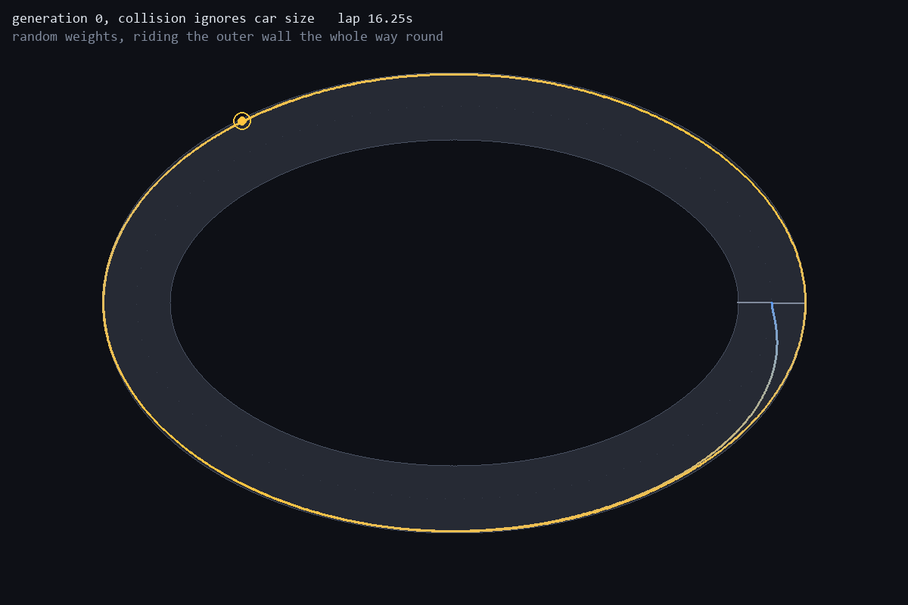
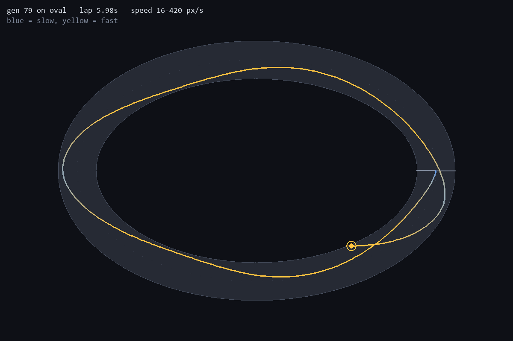

# 3. Generation one cheats

*2026-08-26*

The car sees eight numbers. Seven raycast distances spread ±90° from its
heading, normalised so 1.0 means "nothing within 250px", plus its own speed as
a fraction of top speed. Those go into a 8→8→3 network — 99 weights total —
which outputs throttle, brake and steer.

99 weights is small on purpose. It is a small enough search space for a genetic
algorithm to make real progress in tens of generations, and it is small enough
that every single connection can be drawn as an individual line in the
visualiser and still be legible.

I ran the first training run on the oval expecting generation 0 to be a hundred
cars driving immediately into a wall.

Instead:

```
  gen       best       mean  alive  laps     lap
    0    10237.5      126.0      1     1  16.25s
```

A car completed a **full lap in generation 0**. From random weights.

## Looking at it instead of believing it

A lap time is just a number, and the number said something implausible, so I
built `evaluate.py` — replay a saved champion and draw its actual trajectory
over the track, coloured by speed.



There it is. The "champion" is pinned against the outer wall for the entire
lap, sliding along it like a bumper-car rail.

## Why it worked

Collision was testing the car's **centre pixel** against the drivable mask. So
a car could sit with half its body inside the wall and pay nothing for it. And
on the smooth convex outer edge of an oval, leaning on the wall is genuinely
the cheapest way round: the wall does your steering for you.

`car_radius` existed in the config. It was never used anywhere.

Avoiding the walls was not an objective. It was decoration.

## The fix is free

Because a track is by construction "every pixel within half-width of the
centerline", the set of positions where a *disc-shaped car* fits is exactly
"every pixel within (half-width − car radius) of the centerline". Shrinking one
number gives a perfect collision mask. No morphological erosion, no per-tick
body sampling, no runtime cost at all:

```python
drivable = best_d2 <= half ** 2                      # tarmac: drawn and sensed
body_ok  = best_d2 <= (half - cfg.car_radius) ** 2   # where the whole car fits
```

Sensors still read the true wall — the car should see where the tarmac actually
ends. Only collision uses the tighter mask.

## What changed

Same seed, same everything else:

```
  gen       best       mean  alive  laps     lap
    0      418.3       23.2      0     0      --     <- no lap at all now
    1    10274.2      158.3      2     1  12.58s
    5    10316.8      803.5     10     1   8.32s
   79    10340.2     7664.8     20     1   5.98s
```

And the champion now drives a real racing line — turning in early, cutting to
the inside through the corners, full 420 px/s down the straights:



The lesson is not "I had a bug". It is that **the population will find every
gap between what you rewarded and what you meant**, immediately, on the first
try, from random weights. I did not have to wait 50 generations for it to
discover the exploit. It was there in generation 0 because a hundred random
genomes is already a decent search of "is there a cheap trick here".

I added `test_car_cannot_ride_the_wall`, which checks that every legal car
centre has a full car radius of tarmac in all four directions around it.

The exploit is still reproducible on demand — `tools/reproduce_wall_hug.py`
sets `car_radius` to 0, which collapses `body_ok` back onto the raw tarmac mask
and recreates the original behaviour exactly:

```
generation 0, car_radius=0: 1 of 100 completed a lap, best score 10,237.5
generation 0, car_radius=6: 0 of 100 completed a lap, best score 418.3
```

Next: what it looks like while it learns.
