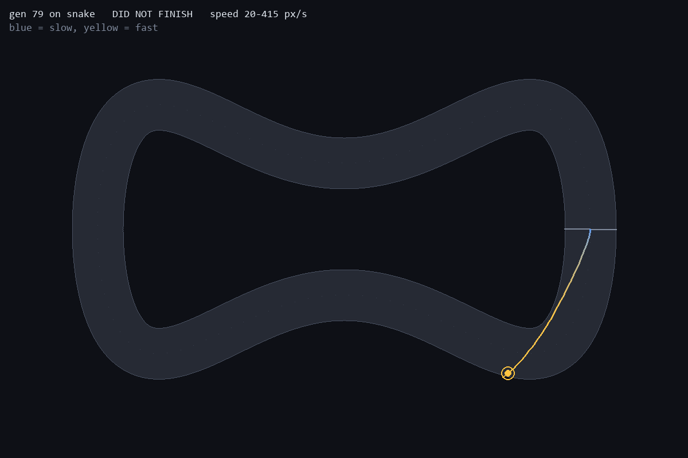

# 5. One of them learned to drive. The other memorised a track.

*2026-08-26*

Two champions, trained identically — same algorithm, same network, same
population size, same 99 weights, same seed. The only difference is which track
they were trained on.

The oval champion laps in 5.98s. The snake champion laps in 8.47s. On lap time
alone the oval champion looks like the better driver.

It is not. It cannot drive at all.

## Putting them on tracks they have never seen

```
oval-trained champion (gen 79)
  oval      lap 5.98s      then crashes at 7.18s
  snake     DID NOT FINISH -- dead after 1.10s, 294px of a 2436px lap
  chicane   DID NOT FINISH -- dead after 2.15s, 589px of a 2512px lap

snake-trained champion (gen 199)
  oval      lap 6.18s      survives the full 40s (about 7 laps)
  snake     lap 8.47s      survives the full 40s
  chicane   lap 8.12s      survives the full 40s
```



The oval champion drives straight into the first wall it meets. Twelve percent
of a lap.


The snake champion carves a clean line through both S-bends, and you can see it
braking — the trail goes blue at the tightest point in the bottom-left corner
and yellow again down the straights.

But notice the detail that gives the whole thing away: **the oval champion
crashes on the oval too**, at 7.18 seconds, right after finishing its lap. It
cannot do a second lap of the track it was trained on.

## The test that settles it

That last detail suggested a hypothesis: the oval champion never learned a
policy at all. It learned an open-loop sequence of turns that happens to fit
one lap of one track from one starting position, and it is not reading its
sensors in any meaningful way.

Lap time cannot distinguish those. So `robustness.py` drops a champion at 24
points around the lap at 3 lateral offsets each — 72 different starting poses —
and counts how many it survives:

```
champion gen 79, trained on oval
track      starts  survived  completed a lap     best
chicane        72         0         0 (  0%)       --
oval           72         0         4 (  6%)    5.98s
snake          72         0         0 (  0%)       --

champion gen 199, trained on snake
track      starts  survived  completed a lap     best
chicane        72        72        72 (100%)    7.92s
oval           72        72        72 (100%)    6.18s
snake          72        72        72 (100%)    8.17s
```

Six percent versus one hundred percent. The oval champion completes a lap from
4 of 72 starts **on its own training track**, and survives none of them. Move it
thirty pixels sideways from where it was born and it is finished.

The snake champion completes a lap from every single start on all three tracks,
including the two it has never seen.

## It is the track's fault, not the algorithm's

Nothing about the genetic algorithm differs between these two runs. What
differs is the selection pressure the track applies.

An oval turns one way, with nearly constant curvature. A fixed steering bias
plus full throttle solves it open-loop. So there is no pressure whatsoever to
read the rays — a genome that ignores all eight inputs and outputs constants can
be the fittest thing in the population. Evolution is lazy in exactly the way you
would expect: it found the cheapest representation that fit the training
distribution, and the cheapest representation was a memorised trajectory.

Snake's S-bends make that impossible. A constant steering bias cannot go left
and then right. The only genomes that survive are ones that actually condition
their steering on what the rays say — and a policy that reads its sensors
transfers to tracks it has never seen, for free.

Which is the whole overfitting story in miniature, arrived at from the wrong
end: I did not set out to demonstrate it. I set out to build a racing game, and
the easy track produced a model that scores well and knows nothing.

## What I would tell past me

The oval is the *worse* training track despite being the easier one, and lap
time on the training track is a completely uninformative metric. If I had only
ever built the oval, I would have shipped the 5.98s champion, written "the AI
learned to drive" in the README, and been wrong.

The test that mattered was the cheap one — spawn it somewhere else and see if it
still works.
