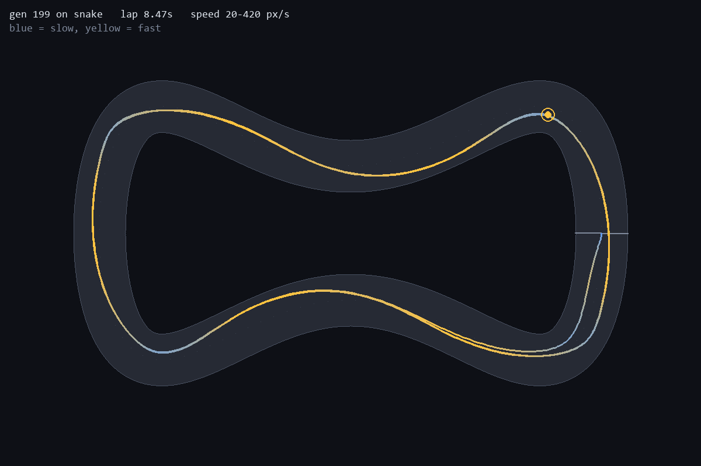
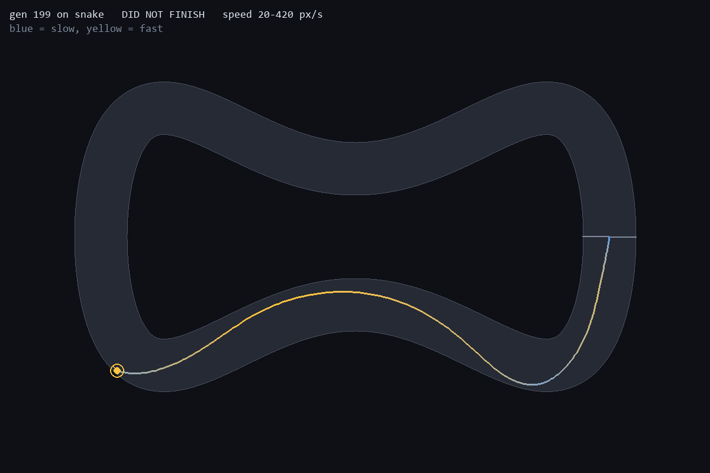

# 5. One memorised a track. One learned to drive. One learned half of it.

*2026-08-26*

Three champions, trained identically — same algorithm, same 99-weight network,
same population size, same seed, 200 generations each. The only difference is
which track they saw.

| Champion | its own best lap |
| --- | --- |
| oval | 5.98s |
| chicane | 7.87s |
| snake | 8.47s |

On lap time the oval champion looks like the best driver by a wide margin. It
is the only one of the three that cannot drive.

## The test that settles it

Training always spawns every car from the same pose facing the same way. That
means a genome can score beautifully by encoding one open-loop sequence of
turns that happens to fit the track, without ever reading its sensors — and lap
time cannot tell that apart from an actual policy.

So `robustness.py` drops a champion at 24 points around the lap at 3 lateral
offsets each — 72 different starting poses — and counts how many it survives.
Run on every champion against every track:

```
                    oval          snake         chicane
oval-trained        6%  (0 alive)  0%            0%
chicane-trained     100%           0%            100%
snake-trained       100%           100%          100%
```

Three completely different outcomes from one algorithm.

## The oval champion memorised a trajectory

Six percent, and zero survivors, **on its own training track**. It completes a
lap from 4 of 72 starts. Move it thirty pixels sideways from the exact pose it
was born at and it is finished.

It also crashes on the oval at 7.18s — right after finishing its lap. It cannot
do a *second* lap of the track it was trained on, because by then it has drifted
off the one trajectory it knows.


On snake it manages 294px of a 2436px lap before driving into the first wall.

The cause is the track. An oval turns one way with nearly constant curvature,
so a fixed steering bias plus full throttle solves it open-loop. There is no
selection pressure to read the rays at all — a genome that ignores all eight
inputs and emits constants can be the fittest thing in the population.
Evolution found the cheapest representation that fit the training distribution,
and the cheapest representation was a memorised path.

## The snake champion learned a policy



100% from every start on all three tracks, including the two it never saw. It
survives the full 40-second episode everywhere, which on the oval means about
seven consecutive laps.

You can see it braking: the trail goes blue at the tightest point in the
bottom-left and yellow again down the straights. Snake's S-bends make a fixed
steering bias useless — you cannot go left and then right with a constant — so
the only genomes that survive are ones conditioning their steering on what the
rays say. And a policy that reads its sensors transfers to unseen tracks for
free.

## The chicane champion is the interesting one

This is the case I did not predict, and it is the one that actually explains
the mechanism.

The chicane champion is **100% robust on oval and chicane** — from any start,
every time. It is not a memorised trajectory; it is a real policy. But on snake
it fails from all 72 starts.



Look at where it dies. It drives the first S-bend cleanly and confidently —
that is a corner well within its experience. Then it reaches the bottom-left
hairpin and goes straight into the wall.

That hairpin is snake's 70px-radius corner. The tightest corner on chicane is
172px. The car has to be down to about 145 px/s to hold 70px; chicane never
required slower than 280 px/s. So the chicane champion learned a genuine,
sensor-reading, generalising policy — for the range of corners it was shown,
and no further.

## What the three cases actually say

The generalisation ceiling is set by **the hardest corner in the training
distribution**, not by the algorithm and not by the network size. All three
runs used the identical 99 weights.

- oval — no pressure to read sensors at all → memorised trajectory, 6%
- chicane — pressure to read sensors, corners to 172px → real policy, fails below that
- snake — pressure plus the tightest corner in the set → transfers everywhere

Which is the whole overfitting story in miniature, arrived at from the wrong
end. I was not trying to demonstrate it. I was trying to build a racing game,
and the easy track produced a model with an excellent score that knows nothing.

## What I would tell past me

The oval is the *worst* training track despite being the easiest, and lap time
on the training track is a completely uninformative metric. If I had only built
the oval I would have shipped the 5.98s champion, written "the AI learned to
drive", and been wrong.

The test that mattered took twenty minutes to write: spawn it somewhere else
and see if it still works.

The obvious next experiment is training on all three tracks at once and seeing
whether that beats snake alone, or whether snake alone was already sufficient
because it contains the hardest case.
