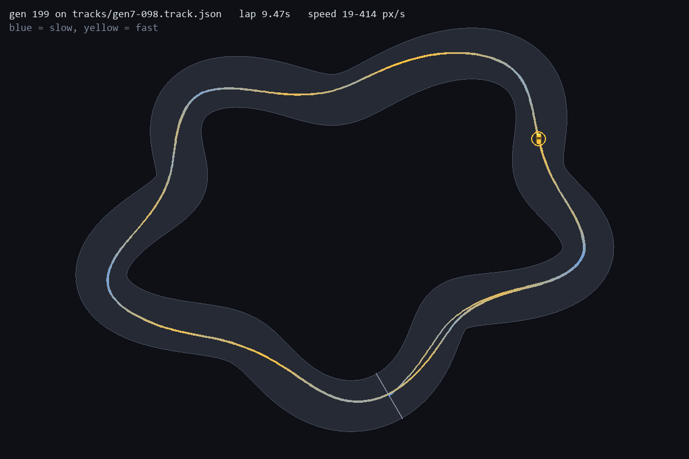

# Both ways round

The prediction is in [10](10-prediction-direction.md), committed (8f2f845)
before any of these runs. Snake, 200 generations, population 100, seeds 1 to 5,
three conditions, 15 runs in parallel. Each run took 466 to 566s, or 898 to 988s
for both-ways. Every champion is the final generation's, scored from 72 starts
per track by `direction.py`:

```
python train.py --track snake --direction forward|reverse|both --seed N --generations 200
python direction.py --json docs/direction.json
```

Seed 1 forward rebuilt the published snake champion bit for bit, so the
forward row for seed 1 is devlog 09's champion.

| Condition | seed | snake | snake reversed | 7 built-ins | 7 reversed | generated cw | generated ccw |
| --- | --- | --- | --- | --- | --- | --- | --- |
| forward | 1 | 100% | **0%** | 99% | 0% | 48/50 | 0/50 |
| forward | 2 | 100% | 67% | 99% | 82% | 49/50 | 34/50 |
| forward | 3 | 38% | 0% | 22% | 14% | 0/50 | 7/50 |
| forward | 4 | 100% | 86% | 90% | 82% | 42/50 | 21/50 |
| forward | 5 | 100% | 0% | 77% | 45% | 36/50 | 5/50 |
| reverse | 1 | 96% | 100% | 99% | 100% | 46/50 | 50/50 |
| reverse | 2 | 0% | 97% | 59% | 95% | 27/50 | 50/50 |
| reverse | 3 | 0% | 100% | 17% | 14% | 8/50 | 0/50 |
| reverse | 4 | 0% | 100% | 0% | 100% | 0/50 | 46/50 |
| reverse | 5 | 0% | 100% | 46% | 86% | 11/50 | 38/50 |
| **both** | 1 | 100% | 100% | 100% | 100% | **50/50** | **50/50** |
| **both** | 2 | 100% | 100% | 100% | 100% | 50/50 | 50/50 |
| **both** | 3 | 100% | 100% | 100% | 100% | 50/50 | 50/50 |
| **both** | 4 | 100% | 100% | 100% | 100% | 50/50 | 50/50 |
| **both** | 5 | 100% | 100% | 100% | 100% | 50/50 | 50/50 |

(Built-in columns are the mean lap rate over the seven tracks. The both-ways
rows are 100% on every track except seed 2 on reversed ripple, 97%.)

## Scoring the prediction

| | prediction | result | |
| --- | --- | --- | --- |
| 1 | at least 4 of the forward runs that learned fail reversed snake | 2 of 4 | **wrong** |
| 2 | at least 4 of the reverse runs that learned fail forward snake | 4 of 5 | held, at the threshold |
| 3 | at least 4 of 5 both-runs lap snake both ways | 5 of 5 | held |
| 4 | at least 4 of 5 both-runs within 10 tracks, cw against ccw | 5 of 5, every one 50 and 50 | held |
| 5 | the median both-run is no more than 5 clockwise tracks behind forward | 50 against 42 | held, and it's ahead |

Forward seed 3 never learned its own track (38%), so predictions 1 and 2 count
four forward runs and five reverse runs.

## What it says

**Seed 1 was the extreme case, not the typical one.** Two of the four forward
runs that learned also drive reversed snake (67% and 86% of starts), and two
don't. Training in one direction doesn't reliably produce a one-way driver. It
produces a coin flip on how much transfers. The same holds for reverse, where
seed 1 laps forward snake from 96% of starts. Devlog 09 measured one seed at
the far end of that spread and read it as the method.

**Asking for both directions removes the spread entirely.** All five both-ways
champions lap all 100 generated tracks and all seven built-ins in both
directions, from every start except 2 of 72 on reversed ripple (seed 2). Two of
the ten one-way runs (forward 2, reverse 1) also lap every built-in both ways,
but they lap 83 and 96 of the generated tracks, not 100.


The seed 1 both-ways champion on reversed snake: 8.48s, against 8.47s the other
way round. Devlog 09's champion went into the wall 3.9s into this lap.

## What I didn't predict

The both-ways champions also lap the 13 generated tracks whose tightest corner
is under 51px, the snake floor from the corner sweep. The tightest is 40.6px,
0.58 of snake's 70px, well past the "roughly 25% tighter, then a cliff" of
devlog 07.



The tightest counter-clockwise generated track (42.5px): lapped in 9.47s,
braking into each tight corner. The published champion laps it from 0 of 72
starts.

There are two readings, and **this experiment can't tell them apart**:

- Direction variety makes a more general policy, including on corners.
- Both-ways training simply had twice the simulation per generation (every car
  drove both versions of the track, every generation), so this is more
  training, not better training.

The control that separates them is forward-only training with the simulation
budget matched: 400 generations, or snake plus a second clockwise track. Until
that runs, the corner result is an observation, not a finding.

**Update:** it ran ([13](13-more-training.md)). The corner gain was mostly the
extra training. The direction result held: one-way training at matched budget
made a two-way driver in 1 of 5 seeds.

## Corrected claims

> Training on one direction leaves it to chance whether the policy transfers to
> the other: 2 of 4 forward runs did, 1 of 5 reverse runs did. Training on both
> directions made every run direction-free: all five lapped every built-in
> both ways and all 100 generated tracks.

The corner floor in devlog 07 is a property of one-direction training on this
budget. It isn't a limit of the 8-8-3 network: the same network, trained both
ways, clears corners 0.58 of its hardest training corner.

Reproduce:

```
python train.py --track snake --direction both --seed 1 --generations 200
python direction.py --json docs/direction.json
```

`champions/snake-both` is the seed 1 both-ways champion, pinned by
`test_training_both_ways_round_fixes_it`.
