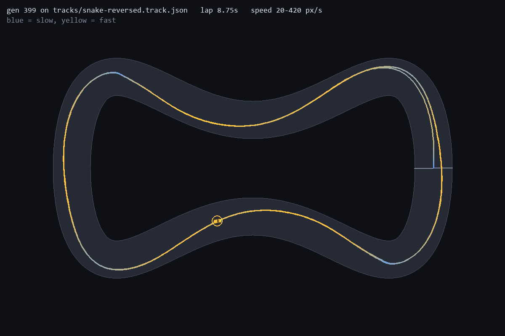

# Direction, and more training

The prediction is in [12](12-prediction-budget.md), committed (5848a44) before
these runs. Two controls, five seeds each, each matched to both-ways training's
simulation budget: forward-400 (snake clockwise, 400 generations) and
snake+chicane (both clockwise, 200 generations, ranked by the mean). Their wall
times confirm the match: 875 to 1000s against both-ways' 898 to 988s. Every
forward-400 run's generation 199 is bit-identical to the matching 200-generation
run, so forward-400 is the forward runs trained for longer, not new runs.

```
python -m scripts.train --track snake --generations 400 --seed N --out runs/snake-400gen-seedN
python -m scripts.train --track snake chicane --seed N
python -m experiments.direction --json docs/results/direction.json
```

Summary across seeds (full per-seed table in `docs/results/direction.json`):

| Condition | generated tracks lapped, per seed | median | ≥45 of 50 counter-clockwise | tight clockwise (of 7), per seed |
| --- | --- | --- | --- | --- |
| forward, 200 gens | 48, 83, 7, 63, 41 | 48 | 0 of 5 | 5, 6, 0, 2, 1 |
| **forward-400** | 62, 40, 2, **100**, 83 | 62 | 1 of 5 | 6, 1, 0, **7**, 6 |
| snake+chicane | 80, 60, 86, 21, 21 | 60 | 0 of 5 | 6, 1, 6, 0, 0 |
| both ways | 100, 100, 100, 100, 100 | 100 | 5 of 5 | 7, 7, 7, 7, 7 |

## Scoring the prediction

| | prediction | result | |
| --- | --- | --- | --- |
| 1 | at most 2 of 5 forward-400 runs lap 45 or more counter-clockwise tracks | 1 of 5 | held |
| 2 | at most 2 of 5 snake+chicane runs do | 0 of 5 | held |
| 3 | each control's median is 4 or fewer of the 7 tight clockwise tracks | forward-400: **6**. snake+chicane: 1 | **wrong for forward-400** |

## What it says

**Direction needs direction data, reliably.** Doubling one-way training made a
two-way driver once in five seeds (forward-400 seed 4 laps everything, both
ways, from every start). A second clockwise track did it none of five times.
Both-ways training did it five of five.



Forward-400 seed 4 on reversed snake, a direction it never trained on: 8.75s.
So one-way training *can* produce a two-way driver. It just usually doesn't.

**The corner gain was mostly the extra training.** On the 7 tight clockwise
tracks, the forward median went from 2 at 200 generations to 6 at 400. That's
the outcome devlog 12 said would mean devlog 07's 0.75 corner floor was an
under-trained floor, and it was. Forward-400 seeds 1, 4 and 5 all lap the
tightest track in the set, 40.6px (0.58 of snake's 70px), and that's a limit of
the test set, not a measured floor. What both-ways training added was
**consistency**: 7 of 7 on every seed, where forward-400 has three seeds at 6 or
7 and two at 1 and 0.

**More training isn't monotonic.** Forward-400 seed 2 lapped its own track from
100% of starts at generation 199 and from 83% at 399. Selection only ever sees
the one start pose, and robustness from the other 71 can drift while fitness
climbs. Seed 3 went the other way, from 38% to 71%.

**Clockwise variety cost more than it bought.** Two of five snake+chicane runs
never learned snake (62% and 65% of starts). Averaging over two differently
shaped tracks made the search harder without adding the thing that mattered.
Both-ways training averages over two tracks as well, but the reversed track is
the same shape, which may be why it didn't suffer the same way. That's a guess,
not a measurement.

## Corrected claims

> Driving in both directions has to be trained. One-way training, even at twice
> the budget, produced a two-way driver in 1 of 10 runs, and 0 of 5 with a second
> clockwise track added. Training both ways did it in 5 of 5.
>
> The corner floor from devlog 07 (about 0.75 of the hardest training corner)
> was mostly under-training. At 400 generations, one-way runs lap a median 6 of
> 7 clockwise tracks tighter than it, though unreliably across seeds.

The 1 of 10 counts forward at 200 and 400 generations as separate runs. They
share their first 200 generations, so read it as "once in five seeds, after
the extra training".
