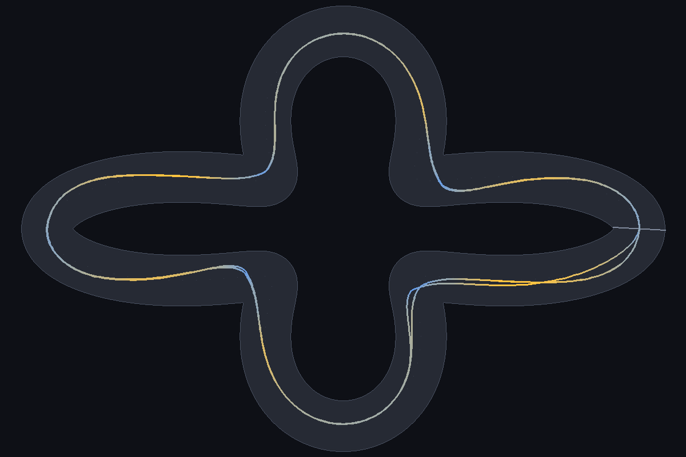
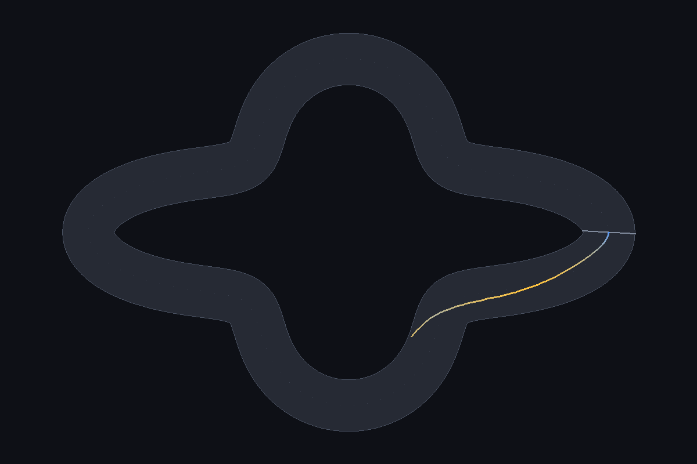

# The corner floor, and random start poses

Predictions: [14](14-prediction-floors.md), committed in b6e2c51, with the
ruler amended in 341c17c before any champion was scored.

```
python train.py --track snake --random-starts --seed N --generations 400
python floors.py --json docs/floors.json
python direction.py --json docs/direction.json
```

## A. The floor

32 rungs of the wave family at 0.9 scale, 153px down to 12px, each champion in
its trained direction(s), 72 starts per rung. The floor is the tightest rung
reached without a failure on the way down. Only runs that learned their own
track count.

| Condition | runs that learned | floors | median |
| --- | --- | --- | --- |
| forward, 200 gens | 4 | 41, 41, 44, 64 | 43 |
| random-start, gen 199 | 5 | 47, 37, 41, 55, 127 | 47 |
| snake+chicane | 3 | 37, 68, 33 | 37 |
| reverse | 5 | 25, 37, 44, 58, and one with no floor | 41 |
| forward-400 | 3 | 33, 22, 27 | 27 |
| random-start, gen 399 | 5 | 22, 33, 30, 58, 96 | 33 |
| **both ways** | 5 | **12, 17, 12, 12, 12** | **12** |

Reverse seed 3 lapped its own reversed track from every start but failed even
the widest rung, so it has no floor.

| | prediction | result | |
| --- | --- | --- | --- |
| A1 | no champion's floor is under 20px | four both-ways champions reach the last rung, 12px | **wrong** |
| A2 | the published champion's floor is 48.2 to 55.4px | 41.4px | **wrong** |
| A3 | forward-400 median at least two rungs tighter than forward-200 | 27 against 43, five rungs | held |
| A4 | both-ways median within one rung of forward-400 | 12 against 27, nine rungs | **wrong** |

### Why A1 failed: centerline radius stops being the corner



The 12px rung, lapped by both-ways seed 1 in 13.5s. The 12px is the centerline
at the tip of each side lobe. The road there is a wide, rounded blob, and the
car drives round it on an arc several times wider. Nothing about this lap
needs a 12px turn.



Where it gets hard instead: forward seed 4 on the 41px rung. It goes off at
the neck where the track switches from turning one way to the other, not at the
tightest point.

The same champion passes every rung from 20px to 12px after failing everything
from 41px to 22px. On this family, difficulty isn't monotone in centerline
radius below about 45px, and the sweep past that point measures the necks as
much as the corners. The floors above are still a fair comparison between
conditions, because they all used the same ruler. They just aren't radii the
car had to turn.

The same goes for the 40px minimum that the track loader and the virtual-world
editor enforce. Its old rationale, that "below this no speed gets a car round",
is false: these champions lap 12px centerline corners. The rule stays, because
the generated held-out set depends on it and changing it would change seed 7's
tracks. Its reason is now the one this devlog supports: below 40px, the
centerline radius stops describing the corner the car drives.

### Why A4 failed: direction training helps corners after all

Devlog 13 concluded that the corner gain from both-ways training was "mostly
the extra training". That came from 7 generated tracks, all of which the best
one-way runs also lapped. On a ruler that keeps going, the budget-matched
one-way runs stop at 22 to 33px, and every both-ways champion clears the whole
thing. The wave family's hard parts are necks where the turn reverses. A car
trained to turn both ways through every corner handles those better, but that's
my reading of where it fails, not something this sweep isolates.

So devlog 13's claim holds on generated tracks and is wrong on this family. The
honest version: extra training moves the floor a long way (43 to 27px), and
training both directions moves it further (12px, the end of the ruler).

## B. Random start poses

| | prediction | result | |
| --- | --- | --- | --- |
| B1 | at least 4 of 5 learn their own track by gen 199 | 5 of 5 (97 to 100% of starts) | held |
| B2 | none loses over 5 points on its own track from gen 199 to 399 | none: the biggest change is 97% to 96% | held |
| B3 | at most 2 of 5 lap 45 or more counter-clockwise tracks | 0 of 5 | held |
| B4 | at least 4 of 5 lap 45 or more clockwise generated tracks | 2 of 5, same as ordinary training | **wrong** |

Random starts do what they're for. Every run learned its own track from every
start, and none drifted over the extra 200 generations, unlike forward-400
seed 2 (100% to 83%).

They don't do more than that. At generation 199 random-start runs generalise
no better than ordinary ones (floor median 47px against 43px, 2 of 5 on clockwise
generated tracks either way). Seed 5 is the clearest case: it laps its own track
from 97% of starts and none of the 50 clockwise generated tracks. **Being
robust on one track is not the same as generalising.** It makes a robust
specialist.

## Where that leaves the claims

- Direction must be trained (devlogs 11 and 13, unchanged).
- The corner floor depends on how you train: 43px after 200 one-way
  generations, 27px after 400, 12px or better both ways. It isn't a property of
  the network.
- Random starts fix robustness drift on the training track and nothing else.
- Past about 45px on the wave family, centerline radius measures the track's
  shape more than its difficulty.
